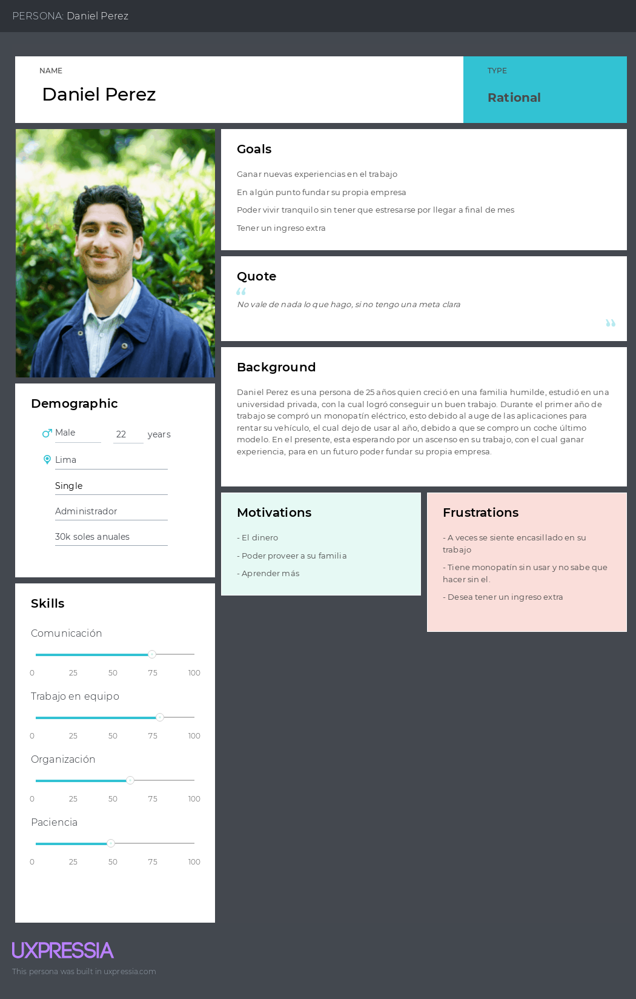
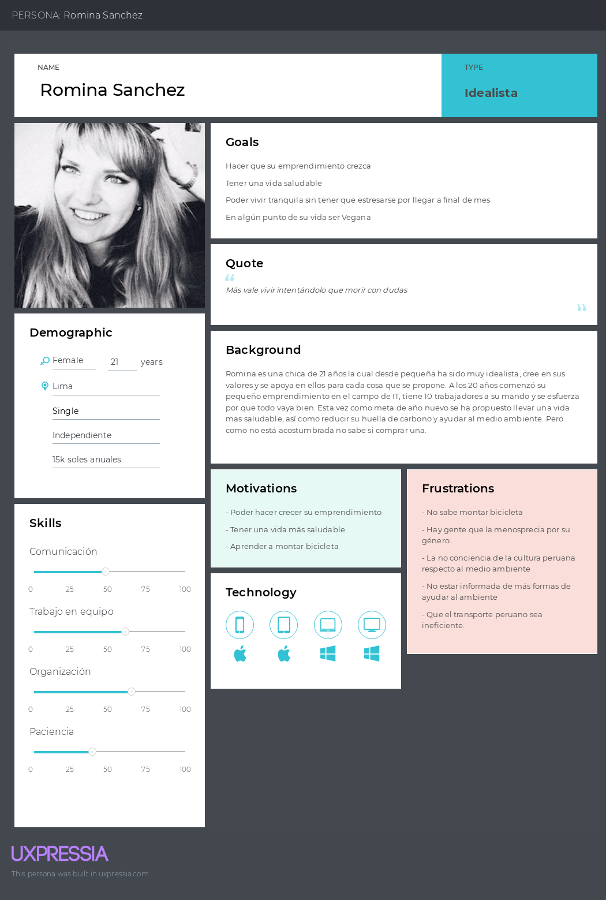

# **Capítulo II:  Requirements Elicitation & Analysis**
## 2.1. Competidores.

<table>
    <thead>
        <tr>
            <th>Nombre</th>
            <th>Descripción</th>
        </tr>
    </thead>
    <tbody>
        <tr>
            <td rowspan align="center">WHOOSH
            <td>El enfoque de Whoosh es ofrecer una alternativa de transporte ecológica y eficiente mediante el alquiler de bicicletas eléctricas compartidas, contribuyendo así a la mejora de la movilidad urbana en las ciudades donde opera. 
            Página web:<a href="https://whoosh.bike/es_la/pe"> https://whoosh.bike/es_la/pe</a>
        </tr>
        <tr>
            <td align="center">Airbnb
            <td>El enfoque principal de Airbnb es proporcionar una plataforma digital que conecta a personas que buscan alojamiento temporal con anfitriones que ofrecen una variedad de opciones de hospedaje. La empresa se centra en ofrecer una experiencia de viaje única y personalizada para sus usuarios, permitiéndoles explorar alojamientos únicos y sumergirse en la cultura local durante sus viajes. 
            Página web:<a href="https://www.airbnb.com.pe/"> https://www.airbnb.com.pe/</a>
        </tr>
        <tr>
           <td rowspan align="center">CityBikeLima 
           <td>El enfoque de CityBike Lima se centra en fomentar la movilidad sostenible mediante el alquiler de bicicletas compartidas, con el objetivo de mejorar la calidad de vida en la ciudad de Lima y promover un entorno urbano más saludable y habitable. 
           Página web:<a href="https://www.citybikelima.com/"> https://www.citybikelima.com/</a>
    </tbody>
</table> 

### 2.1.1. Análisis competitivo.

### 2.1.2. Estrategias y tácticas frente a competidores.

<table>
    <thead>
        <tr>
            <th rowspan=2 colspan=2 align="center">MATRIZ FODA</th>
            <th colspan=2 align="center">EXTERNO</th>
        </tr>
        <tr>
            <td>Oportunidades: - Expansión de la flota de vehículos eléctricos para satisfacer la creciente demanda. - Colaboración con empresas locales para promover la movilidad sostenible. - Expansión a nuevos mercados geográficos con alta demanda de movilidad urbana.</td>
            <td>Amenazas: - Cambios regulatorios que afecten la operación de servicios de alquiler de vehículos eléctricos. - Competencia de otras aplicaciones de movilidad urbana con servicios similares. - Riesgo de accidentes o vandalismo que afecten la disponibilidad y seguridad de los vehículos.</td>
        </tr>
    </thead>
    <tbody>
        <tr>
            <th rowspan=2 align="center">INTERNO</th>
            <td>Fortalezas:   - Variedad de vehículos eléctricos disponibles para alquilar. - Plataforma intuitiva para emprendedores que facilita la gestión de reservas y control de inventario. - Experiencia de usuario fluida y atractiva en la aplicación web.</td>
            <td>Estrategias FO: - Diversificación y ampliación de la flota de vehículos eléctricos. - Desarrollo de alianzas estratégicas con empresas locales. - Expansión a nuevos mercados geográficos.</td>
            <td>Estrategias FA: - Promoción de la movilidad eléctrica y sostenible - Plataforma intuitiva y la experiencia de usuario fluida y atractiva - Implementación de GPS en los vehículos</td>
        </tr>
        <tr>
            <td>Debilidades: - Dependencia de la disponibilidad y mantenimiento de los vehículos eléctricos. - Posible limitación en la infraestructura de carga en ciertas áreas. - Competencia con empresas de alquiler de vehículos tradicionales.</td>
            <td>Estrategias DO: - Desarrollo de alianzas estratégicas para mejorar la disponibilidad y el mantenimiento de vehículos eléctricos - Diferenciación del servicio para competir con empresas de alquiler de vehículos tradicionales.</td>
            <td>Estrategias DA: - Ofrecer servicios de transporte compartido  - Posible colaboración con empresas de turismo local.</td>
        </tr>
    </tbody>
</table>

## 2.2. Entrevistas.

El objetivo de las entrevistas es obtener una comprensión profunda de las experiencias, perspectivas y opiniones de los segmentos de mercado seleccionados. Nuestra meta es recopilar información valiosa que nos permita entender mejor a nuestro público objetivo y mejorar nuestra comprensión de los usuarios. Estas conversaciones nos proporcionarán una visión más clara de las necesidades y deseos de nuestros usuarios, lo que nos ayudará a adaptar nuestros productos o servicios de manera más efectiva a sus requisitos.

### 2.2.1. Diseño de entrevistas.

**Preguntas Generales:**

- ¿Cuál es tu nombre?
- ¿Cuántos años tienes?
- ¿En qué distrito vives?
- ¿Cuál es tu ocupación?

**Preguntas para los “Usuarios que Alquilan”:**
- ¿Qué tipo de vehículo eléctrico te interesaría alquilar con mayor frecuencia? (Por ejemplo, bicicletas, scooters, monopatines, motos eléctricas, etc.)
- ¿Qué características consideras más importantes al buscar un servicio de alquiler de vehículos eléctricos o mecánicos? (Por ejemplo, facilidad de reserva, variedad de vehículos disponibles, precios transparentes, etc.)
- ¿Qué te motiva a utilizar servicios de alquiler de vehículos eléctricos en lugar de otras opciones de movilidad urbana?
- ¿Tienes alguna preocupación o reserva específica sobre el alquiler de vehículos eléctricos que te gustaría que la plataforma abordara?
- ¿Qué funcionalidades o características adicionales te gustaría ver en una plataforma de alquiler de vehículos eléctricos o mecánicos como la nuestra para mejorar tu experiencia de usuario?
- ¿Que tecnologias usas?

**Preguntas para los “Propietarios de los Vehículos”:**
- ¿Qué tipo de vehículos posees actualmente?
- ¿Has considerado alguna vez la posibilidad de alquilar tus vehículos?
Si has pensado en alquilarlos, ¿qué factores te han impedido hacerlo hasta ahora?
- ¿Qué tipo de vehículos estarías dispuesto/a a alquilar a través de una aplicación web?
- ¿Qué te gustaría ver en una plataforma de alquiler de vehículos para sentirte cómodo/a al alquilar tus vehículos?
- ¿Qué beneficios crees que podrías obtener al alquilar tus vehículos a través de una aplicación web en comparación con otros métodos?
- ¿Tienes alguna preferencia o requisito específico en cuanto al proceso de alquiler de tus vehículos?
- ¿Qué te motiva a considerar la idea de ofrecer tus vehículos para alquilar a través de una aplicación web?
- ¿Qué expectativas tienes con respecto a cómo una plataforma como la nuestra puede simplificar el proceso de alquiler y aumentar la visibilidad de tus vehículos?
- ¿Tienes alguna preocupación o reserva específica sobre el proceso de alquiler de tus vehículos que te gustaría que la plataforma abordara?
- ¿Que tecnologias usas?

### 2.2.2. Registro de entrevistas.

### Entrevista para el "Propietario de los vehículos":

Entrevista N°1:
**Sexo:** Femenino
**Edad:** 18 años
**Ubicación:** San Martín de Porres
**Entrevistada:** Ariana del Carpio Flores
**Inicio de la Entrevista:** 0:03

**Resumen de la Entrevista**: La entrevistada menciona que normalmente no utiliza su scooter eléctrico, pero le gustaría encontrar una plataforma que le permita darle un uso óptimo en lugar de dejarlo en desuso. Considera que esta herramienta podría ser una oportunidad para contribuir a la reducción de la contaminación, especialmente porque se dirige regularmente a la universidad y no encuentra tiempo para utilizarlo.

**Enlace:** <a href="https://upcedupe-my.sharepoint.com/:v:/g/personal/u202213423_upc_edu_pe/EQh3NNNYUeROu-IXmUgcD_UBhGheSxjDGKPq25GKPsPARw?e=cCbJ49&nav=eyJyZWZlcnJhbEluZm8iOnsicmVmZXJyYWxBcHAiOiJTdHJlYW1XZWJBcHAiLCJyZWZlcnJhbFZpZXciOiJTaGFyZURpYWxvZy1MaW5rIiwicmVmZXJyYWxBcHBQbGF0Zm9ybSI6IldlYiIsInJlZmVycmFsTW9kZSI6InZpZXcifX0%3D"> https://upcedupe-my.sharepoint.com/:v:/g/personal/u202213423_upc_edu_pe/EQh3NNNYUeROu-IXmUgcD_UBhGheSxjDGKPq25GKPsPARw?e=cCbJ49&nav=eyJyZWZlcnJhbEluZm8iOnsicmVmZXJyYWxBcHAiOiJTdHJlYW1XZWJBcHAiLCJyZWZlcnJhbFZpZXciOiJTaGFyZURpYWxvZy1MaW5rIiwicmVmZXJyYWxBcHBQbGF0Zm9ybSI6IldlYiIsInJlZmVycmFsTW9kZSI6InZpZXcifX0%3D</a>

Entrevista N°2:

**Sexo:** Femenino
**Edad:** 22 años
**Ubicación:** Magdalena
**Entrevistada:** Francesca Frassinelli
**Inicio de la Entrevista:** 0:03

**Resumen de la Entrevista**: La entrevistada menciona que el único vehículo electrico que ha usado han sido los scooters pero estaria dispuesta a probar una bicicleta o una moto ya que menciona que le da más seguridad. Para ella el costo es lo que es más importante a la hora de alquilar un vehículo.

**Enlace:** <a href="https://youtu.be/qCatPH2mMvU">https://youtu.be/qCatPH2mMvU</a>

Entrevista N°3:

### Entrevista para los "Usuarios que desean alquilar":

Entrevista N°1:

**Sexo:** Femenino
**Edad:** 21 años
**Ubicación:** Magdalena del Mar
**Entrevistada:** Daniela Chavez
**Inicio de la Entrevista:** 0:01

 

**Resumen De Entrevista:** Según las respuestas proporcionadas, la entrevistada comenta que usualmente se manifiesta por medio de transporte público, pero que estaba considerando ir en bicicleta o scooter eléctrico, este último debido a su velocidad. Comenta que cada vez en Lima, ve que cada vez más gente se moviliza por scooters y a su vez ve más gente usando ciclovías, lo cual considera que ayuda al medio ambiente además de que lo bueno de usar bicicletas sería el ejercicio. Además logras evitar el tráfico, asi como evitas pasarla mal en combi. Considera que si los precios son accesibles y favorecen a los usuarios podria ayudar a la obtención de nuevos hábitos.

**Enlace:** <a href="https://upcedupe-my.sharepoint.com/:v:/g/personal/u20201e475_upc_edu_pe/EYx2pVo5UL9Bo3dJ6odmiQYBCXzDww46iPP-WgpJU6sw5Q?e=xfadMp&nav=eyJyZWZlcnJhbEluZm8iOnsicmVmZXJyYWxBcHAiOiJTdHJlYW1XZWJBcHAiLCJyZWZlcnJhbFZpZXciOiJTaGFyZURpYWxvZy1MaW5rIiwicmVmZXJyYWxBcHBQbGF0Zm9ybSI6IldlYiIsInJlZmVycmFsTW9kZSI6InZpZXcifX0%3D"> https://upcedupe-my.sharepoint.com/:v:/g/personal/u20201e475_upc_edu_pe/EYx2pVo5UL9Bo3dJ6odmiQYBCXzDww46iPP-WgpJU6sw5Q?e=xfadMp&nav=eyJyZWZlcnJhbEluZm8iOnsicmVmZXJyYWxBcHAiOiJTdHJlYW1XZWJBcHAiLCJyZWZlcnJhbFZpZXciOiJTaGFyZURpYWxvZy1MaW5rIiwicmVmZXJyYWxBcHBQbGF0Zm9ybSI6IldlYiIsInJlZmVycmFsTW9kZSI6InZpZXcifX0%3D</a>

Entrevista N°2:

Entrevista N°3:

### 2.2.3. Análisis de entrevistas.

**Propietario del vehículo:** Nuestro principal público objetivo son aquellos propietarios que desean ofrecer sus vehículos, como bicicletas, scooters y otros medios de transporte menores, con el objetivo de mantenerlos en uso y permitir a los usuarios probar nuestro servicio, generando confianza en él. Priorizamos la reducción del tráfico y contribuir al medio ambiente al promover el uso de medios de transporte más sostenibles. Además, buscamos facilitar una gestión eficiente y una colaboración mutua entre ambos segmentos de usuarios.

**Usuario que desea alquilar:** Nuestra principal audiencia son aquellos interesados en alquilar vehículos con propósitos recreativos o para probar nuestro servicio, destacando la importancia de la formalidad, la reducción del tráfico y la sostenibilidad al elegir opciones libres de gasolina, en consonancia con nuestro compromiso medioambiental.

## 2.3. Needfinding.

El Needfinding es una metodología cualitativa la cual se enfoca en las opiniones y sentimientos de los usuarios. El objetivo de este método como se indica en el mismo nombre es identificar, buscar, analizar, conseguir, rescatar, valorar, o términos sencillos, buscar las necesidades que puedan guiar y orientar el desarrollo y diseño de cualquier proyecto.
Para este proyecto en particular decidimos interactuar con potenciales usuarios mediante entrevistas y preguntas. A continuación se presentan diversos análisis de entrevistas en los siguientes artefactos.

### 2.3.1. User Personas.

#### 2.3.1.1. Segmento Propietario del Vehículo.

#### 2.3.1.2. Segmento Persona que alquila.

### 2.3.2. User Task Matrix.

| User task                                 | Propietario                                 | Alquilador                                  |
|-------------------------------------------|--------------------------------------------|--------------------------------------------|
| Publicar vehículo                       | Frecuencia: Alta Importancia: Alta       | -                                            |
| Gestionar reservas                      | Frecuencia: Alta Importancia: Alta       | Frecuencia: Alta Importancia: Alta       |
| Responder consultas                     | Frecuencia: Media Importancia: Alta      | Frecuencia: Alta Importancia: Media      |
| Actualizar disponibilidad del vehículo  | Frecuencia: Alta Importancia: Media     | -                                            |
| Revisar perfil del alquilador           | Frecuencia: Media Importancia: Baja      | -                                            |
| Puntuar alquilador                     | Frecuencia: Baja Importancia: Baja       | Frecuencia: Media Importancia: Media     |

### 2.3.3. User Journey Mapping
### 2.3.4. Empathy Mapping.
### 2.3.5. As-is Scenario Mapping.
## 2.4. Ubiquitous Language