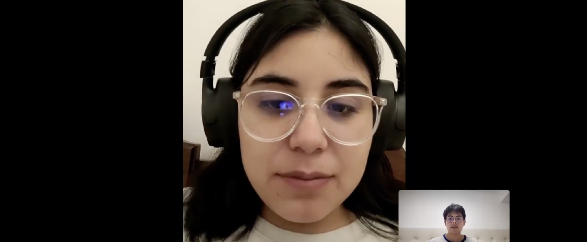

# **Capítulo II:  Requirements Elicitation & Analysis**
## 2.1. Competidores.
### 2.1.1. Análisis competitivo.
### 2.1.2. Estrategias y tácticas frente a competidores.
## 2.2. Entrevistas.
El objetivo de las entrevistas es obtener una comprensión profunda de las experiencias, perspectivas y opiniones de los segmentos de mercado seleccionados. Nuestra meta es recopilar información valiosa que nos permita entender mejor a nuestro público objetivo y mejorar nuestra comprensión de los usuarios. Estas conversaciones nos proporcionarán una visión más clara de las necesidades y deseos de nuestros usuarios, lo que nos ayudará a adaptar nuestros productos o servicios de manera más efectiva a sus requisitos.
### 2.2.1. Diseño de entrevistas.
* ** **
### Entrevista para Usuarios que desean brindar alquiler:

### Entrevista para Usuarios que desean alquilar:
- **Taxistas Experimentados:**

- **Conductores Jóvenes:** 
**Entrevista #1**  
Nombre y apellidos: Daniela Chavez  
Edad: 21 años  
Distrito: Magdalena del Mar 
  
Inicio De Entrevista: 0:01  
[URL_De_Entrevista](https://upcedupe-my.sharepoint.com/:v:/g/personal/u20201e475_upc_edu_pe/EYx2pVo5UL9Bo3dJ6odmiQYBCXzDww46iPP-WgpJU6sw5Q?e=xfadMp&nav=eyJyZWZlcnJhbEluZm8iOnsicmVmZXJyYWxBcHAiOiJTdHJlYW1XZWJBcHAiLCJyZWZlcnJhbFZpZXciOiJTaGFyZURpYWxvZy1MaW5rIiwicmVmZXJyYWxBcHBQbGF0Zm9ybSI6IldlYiIsInJlZmVycmFsTW9kZSI6InZpZXcifX0%3D)  
Resumen De Entrevista: Según las respuestas proporcionadas, la entrevistada comenta que usualmente se manifiesta por medio de transporte público, pero que estaba considerando ir en bicicleta o scooter eléctrico, este último debido a su velocidad. Comenta que cada vez en Lima, ve que cada vez más gente se moviliza por scooters y a su vez ve más gente usando ciclovías, lo cual considera que ayuda al medio ambiente además de que lo bueno de usar bicicletas sería el ejercicio. Además logras evitar el tráfico, asi como evitas pasarla mal en combi. Considera que si los precios son accesibles y favorecen a los usuarios podria ayudar a la obtención de nuevos hábitos.
**Entrevista #2**  

### 2.2.2. Registro de entrevistas.
### 2.2.3. Análisis de entrevistas.
## 2.3. Needfinding.
### 2.3.1. User Personas.
### 2.3.2. User Task Matrix.
### 2.3.3. User Journey Mapping
### 2.3.4. Empathy Mapping.
### 2.3.5. As-is Scenario Mapping.
## 2.4. Ubiquitous Language