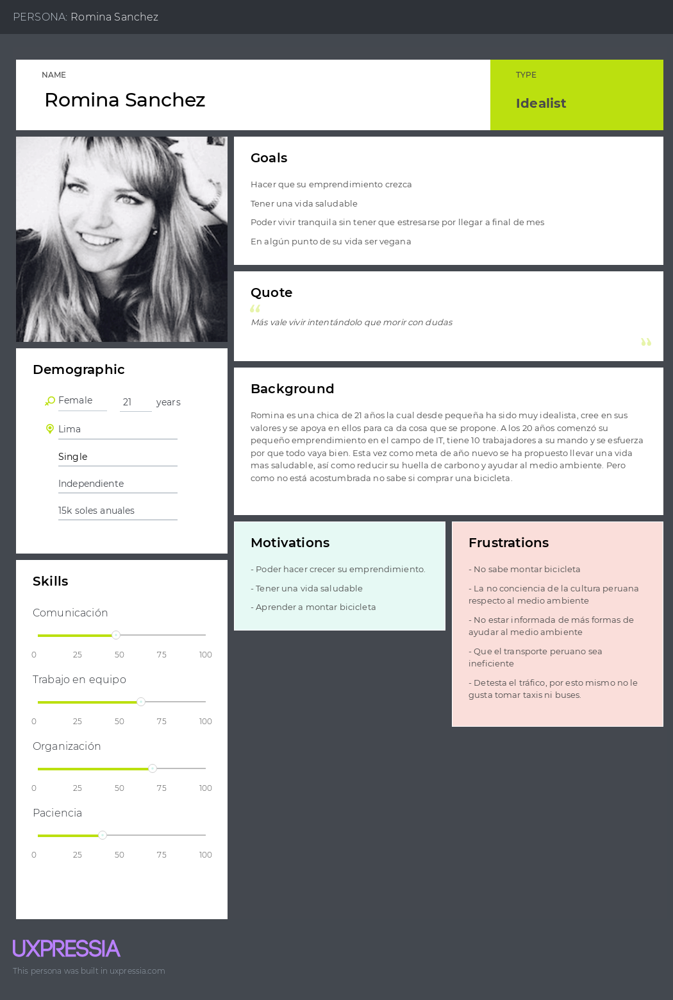

# **Capítulo II:  Requirements Elicitation & Analysis**
## 2.1. Competidores.
### 2.1.1. Análisis competitivo.
### 2.1.2. Estrategias y tácticas frente a competidores.
## 2.2. Entrevistas.
El objetivo de las entrevistas es obtener una comprensión profunda de las experiencias, perspectivas y opiniones de los segmentos de mercado seleccionados. Nuestra meta es recopilar información valiosa que nos permita entender mejor a nuestro público objetivo y mejorar nuestra comprensión de los usuarios. Estas conversaciones nos proporcionarán una visión más clara de las necesidades y deseos de nuestros usuarios, lo que nos ayudará a adaptar nuestros productos o servicios de manera más efectiva a sus requisitos.
### 2.2.1. Diseño de entrevistas.
* ** **
### Entrevista para Usuarios que desean brindar alquiler:

### Entrevista para Usuarios que desean alquilar:
**Entrevista #1**  
Nombre y apellidos: Daniela Chavez  
Edad: 21 años  
Distrito: Magdalena del Mar 
  
Inicio De Entrevista: 0:01  
[URL_De_Entrevista](https://upcedupe-my.sharepoint.com/:v:/g/personal/u20201e475_upc_edu_pe/EYx2pVo5UL9Bo3dJ6odmiQYBCXzDww46iPP-WgpJU6sw5Q?e=xfadMp&nav=eyJyZWZlcnJhbEluZm8iOnsicmVmZXJyYWxBcHAiOiJTdHJlYW1XZWJBcHAiLCJyZWZlcnJhbFZpZXciOiJTaGFyZURpYWxvZy1MaW5rIiwicmVmZXJyYWxBcHBQbGF0Zm9ybSI6IldlYiIsInJlZmVycmFsTW9kZSI6InZpZXcifX0%3D)  
Resumen De Entrevista: Según las respuestas proporcionadas, la entrevistada comenta que usualmente se manifiesta por medio de transporte público, pero que estaba considerando ir en bicicleta o scooter eléctrico, este último debido a su velocidad. Comenta que cada vez en Lima, ve que cada vez más gente se moviliza por scooters y a su vez ve más gente usando ciclovías, lo cual considera que ayuda al medio ambiente además de que lo bueno de usar bicicletas sería el ejercicio. Además logras evitar el tráfico, asi como evitas pasarla mal en combi. Considera que si los precios son accesibles y favorecen a los usuarios podria ayudar a la obtención de nuevos hábitos.
**Entrevista #2**  

### 2.2.2. Registro de entrevistas.
### 2.2.3. Análisis de entrevistas.
## 2.3. Needfinding.
El Needfinding es una metodología cualitativa la cual se enfoca en las opiniones y sentimientos de los usuarios. El objetivo de este método como se indica en el mismo nombre es identificar, buscar, analizar, conseguir, rescatar, valorar, o términos sencillos, buscar las necesidades que puedan guiar y orientar el desarrollo y diseño de cualquier proyecto.
Para este proyecto en particular decidimos interactuar con potenciales usuarios mediante entrevistas y preguntas. A continuación se presentan diversos análisis de entrevistas en los siguientes artefactos.
### 2.3.1. User Personas.
## 2.3.1.1. Segmento Propietario:

## 2.3.1.2. Segmento Persona que alquila:

### 2.3.2. User Task Matrix.
| User task                                   | Propietario                                 | Alquilador                                   |
|-----------------------------------------|---------------------------------------------|----------------------------------------------|
| Publicar vehículo                       | Frecuencia: Alta Importancia: Alta       | -                                            |
| Gestionar reservas                      | Frecuencia: Alta Importancia: Alta       | Frecuencia: Alta Importancia: Alta       |
| Responder consultas                     | Frecuencia: Media Importancia: Alta      | Frecuencia: Alta Importancia: Media      |
| Actualizar disponibilidad del vehículo  | Frecuencia: Alta Importancia: Media     | -                                            |
| Revisar perfil del alquilador           | Frecuencia: Media Importancia: Baja      | -                                            |
| Puntuar alquilador                     | Frecuencia: Baja Importancia: Baja       | Frecuencia: Media Importancia: Media     |

### 2.3.3. User Journey Mapping
### 2.3.4. Empathy Mapping.
### 2.3.5. As-is Scenario Mapping.
## 2.4. Ubiquitous Language